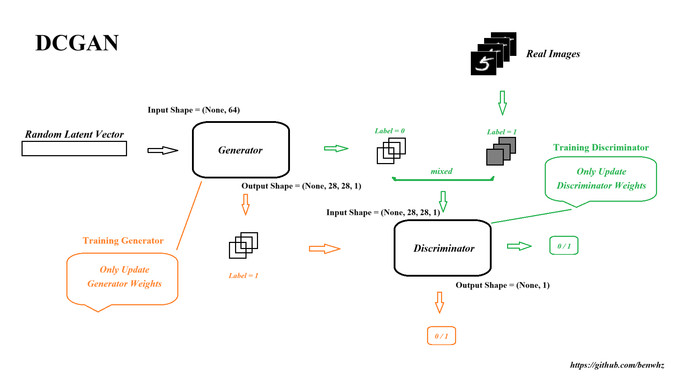

# GANs
Generative Adversarial Networks trained using the MINST dataset to generate handwritten digits

## DCGAN (Deep Convolutional GAN)
1. Paper: 《Unsupervised Representation Learning with Deep Convolutional Generative Adversarial Networks》https://arxiv.org/abs/1511.06434
1. Parameters:
    - image size: 28 * 28
    - latent_dim: 64
1. Discriminator
    - Input shape = (None, 28, 28, 1)
    - Output shape = (None, 1)
1. Generator
    - Input shape = (None, 64)
    - Output shape = (None, 28, 28, 1)
1. Train Discriminator
    - sample random latent vector and create fake images
    - combine them with real images 
    - set real iamge label as 1 (True), and set fake iamge label as 0 (False)
    - train discriminator and get loss
    - calculate the gradient and update '**Discriminator**' weights.
1. Train Generator
    - sample random latent vector and create fake images
    - set the fake iamge label as 1 (True)
    - train the generator and get the loss
    - calculate the gradient and update '**Generator**' weights.
1. Figure: A generator transforms random latent vectors into images, and a discriminator seeks to tell real images from generated ones. The generator is trained to fool the discriminator.

## CGAN (Conditional GAN)
1. Paper: 《Conditional Generative Adversarial Nets》 https://arxiv.org/abs/1411.1784
1. Parameters:
    - image size: 28 * 28
    - latent_dim: 128
    - num_classes: 10
1. Discriminator
    - Input shape = [(None, 28, 28, 1), (None, 10)]
    - Output shape = (None, 1)
1. Generator
    - Input shape = [(None, 128), (None, 10)]
    - Output shape = (None, 28, 28, 1)
1. Train Discriminator
    - sample random latent vector and create fake images
    - combine them with real images 
    - set real iamge label as 1 (True), and set fake iamge label as 0 (False)
    - train discriminator and get loss
    - calculate the gradient and update '**Discriminator**' weights.
1. Train Generator
    - sample random latent vector and create fake images
    - set the fake iamge label as 1 (True)
    - train the generator and get the loss
    - calculate the gradient and update '**Generator**' weights.
1. Figure: A generator transforms random latent vectors into images, and a discriminator seeks to tell real images from generated ones. The generator is trained to fool the discriminator.

